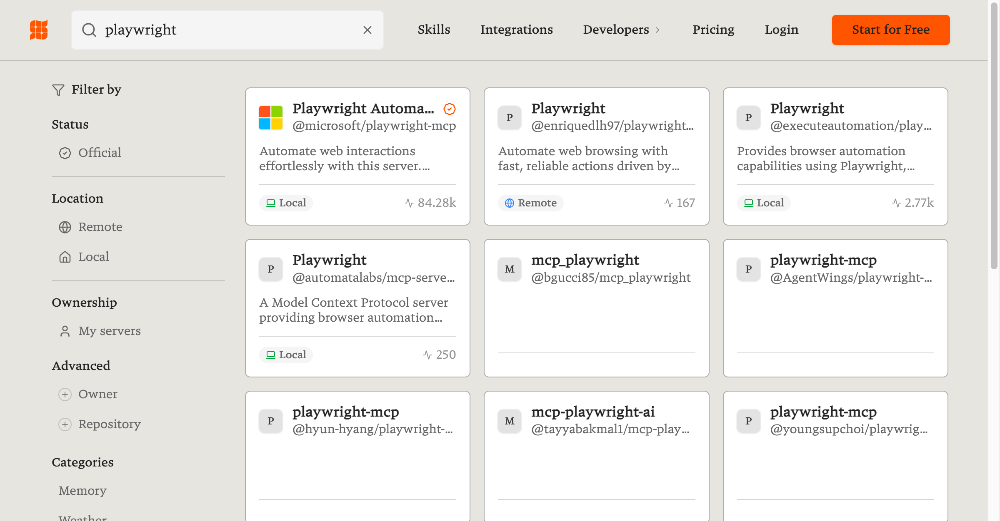
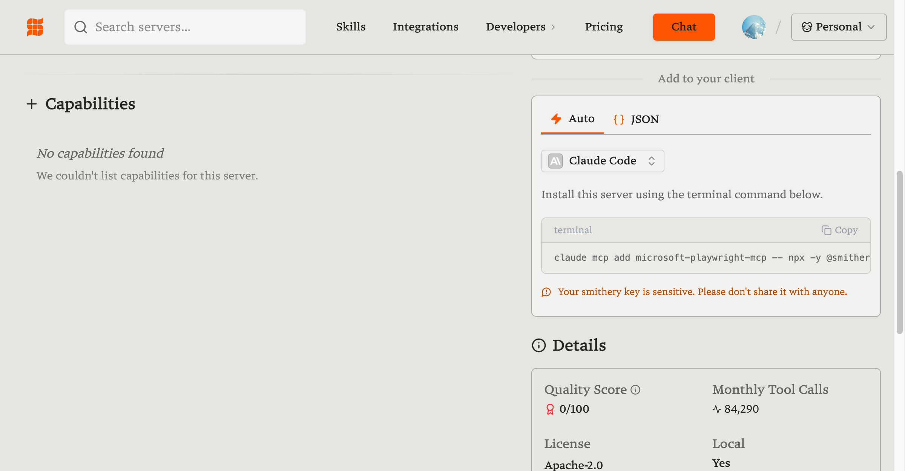

# MCP 工具：给 AI 装上万能插头

> **Vibe 语录：** 在 MCP 出现之前，让 Claude Code 操作浏览器就像让一个人用意念开门。
> MCP 出现后，AI 终于有了一双真正的手，可以帮你点击、填表、截图、查数据库……

欢迎来到 [Claude Code 如何使用](./claude%20code%20如何使用.md) 的进阶篇！如果你已经掌握了 Claude Code 的基础用法，现在是时候给它**装上外挂**了——这就是**MCP**。

本篇会教你：为什么需要 MCP、如何安装最常用的 MCP、以及如何用一句话让 AI 帮你操作浏览器。

---

## 一、为什么需要 MCP？（AI 的能力边界）

### MCP 是什么？

**MCP = Model Context Protocol（模型上下文协议）**

用人话说：

> **比喻：** MCP 就像是 **Type-C 接口**。
> - 有了 Type-C，手机可以连接各种设备：充电器、U 盘、显示器...
> - 有了 MCP，AI 就能连接各种工具：浏览器、文件系统、数据库...
>
> **一句话总结：万能插头**

### 没有 MCP vs 有 MCP

| 场景 | 没有 MCP | 有了 MCP |
|-----|---------|---------|
| 让 AI 访问网页 | "你自己去浏览器看吧，把内容复制给我" | **直接打开网页、截图、提取数据** |
| 让 AI 操作文件 | "你把路径告诉我，我自己去找" | **直接读写、创建、删除文件** |
| 让 AI 查数据库 | "你把 SQL 写出来，我自己执行" | **直接连接数据库，查询返回** |
| 让 AI 发消息 | "你把内容写好，我去飞书/Slack发" | **直接发送消息到指定群组** |

**本质变化：** MCP 让 AI 从"动嘴指挥"变成"动手干活"！

### MCP 的架构（看懂这张图就够了）

```
┌──────────────────────────────────────────────────────────────┐
│                  Claude Code (或其他 AI)                      │
│                    "你让我操作浏览器"                          │
└───────────────────────────┬──────────────────────────────────┘
                            │
                            ↓ MCP 协议（标准化通信）
                            │
       ┌────────────────────┼────────────────────┐
       ↓                    ↓                    ↓
┌────────────┐       ┌────────────┐       ┌────────────┐
│ 浏览器 MCP  │       │ 文件系统 MCP │       │ 数据库 MCP  │
│ (Playwright)│       │(Filesystem)│       │ (SQLite)   │
└──────┬─────┘       └──────┬─────┘       └──────┬─────┘
       ↓                    ↓                    ↓
   Chrome/Edge          本地文件              数据库
```

---

## 二、常用 MCP 工具一览（先收藏）

### MCP 工具表

| MCP 名称 | 核心功能 | 使用场景 | 推荐度 |
|---------|---------|---------|-------|
| **Playwright MCP** | 自动化浏览器、截图、点击 | 测试、爬虫、截图 | ⭐⭐⭐⭐⭐ |
| **Filesystem MCP** | 文件读写操作 | 配置管理 | ⭐⭐⭐⭐⭐ |
| **Fetch MCP** | 发起 HTTP 请求 | 调用 API、接口测试 | ⭐⭐⭐⭐ |
| **SQLite MCP** | 操作 SQLite 数据库 | 数据分析、数据管理 | ⭐⭐⭐⭐ |
| **GitHub MCP** | 管理 Issue、PR、仓库 | 开源协作 | ⭐⭐⭐⭐ |
| **Slack/飞书 MCP** | 发送消息、管理群组 | 团队协作 | ⭐⭐⭐ |

### 按场景组合推荐

**测试开发：**
```
Playwright MCP（测试网页） + Filesystem MCP（保存结果）
```

**数据分析：**
```
Fetch MCP（调用 API） + SQLite MCP（存数据库） + Filesystem MCP
```

**数据爬取：**
```
Playwright MCP（访问网页） + Filesystem MCP（导出 CSV） + SQLite MCP
```

**自动化办公：**
```
Playwright MCP（自动化操作，截图、填表）
```

---

## 三、安装 MCP（推荐：Smithery 一键安装）

> **推荐方式：** 通过 [Smithery.ai](https://smithery.ai) 市场一键安装，最简单！

### 方法一：Smithery 一键安装（强烈推荐！⭐⭐⭐⭐⭐）

Smithery 是 MCP 的官方市场，提供一键安装命令，**复制粘贴即可**。

---

#### 📖 图文教程：3 步搞定 Playwright MCP

**第 1 步：打开 Smithery 网站**

在浏览器访问：**https://smithery.ai**

然后在搜索框输入 `playwright`，找到 **Playwright Automation**（微软官方出品，带 ✓ 认证标志）。



> **认准官方：** 选择 `@microsoft/playwright-mcp`，使用量 84k+，最稳定可靠。

---

**第 2 步：获取一键安装命令**

1. 点击进入 **Playwright Automation** 详情页
2. 在右侧 **Connect** 区域，找到 **Add to your client**
3. 点击下拉框选择 **Claude Code**
4. 复制显示的安装命令



**一键安装命令格式：**
```bash
claude mcp add microsoft-playwright-mcp -- npx -y @smithery/cli@latest run @microsoft/playwright-mcp --key 你的密钥
```

> **注意：** 每个用户的 `--key` 是唯一的，直接从网页复制即可。

---

**第 3 步：粘贴运行，验证成功**

打开终端，粘贴刚才复制的命令并运行：

```bash
# 粘贴从 Smithery 复制的命令
claude mcp add microsoft-playwright-mcp -- npx -y @smithery/cli@latest run @microsoft/playwright-mcp --key 你的密钥

# 启动 Claude Code
claude

# 检查 MCP 连接状态
/mcp
```

看到 `microsoft-playwright-mcp ✓ connected` 就成功了！🎉

---

### 方法二：命令行直接安装（备选）

如果不想注册 Smithery，也可以直接用命令安装（功能相同）：

```bash
# 检查 Node.js 版本（需要 18+）
node --version

# 安装 Playwright MCP（浏览器自动化）
claude mcp add playwright -- npx -y @anthropic-ai/mcp-server-playwright

# 安装 Filesystem MCP（文件读写）
claude mcp add filesystem -- npx -y @anthropic-ai/mcp-server-filesystem

# 查看已安装的 MCP
claude mcp list
```

---

### 验证安装成功

```bash
# 启动 Claude Code
claude

# 检查已连接的 MCP 服务
/mcp
```

看到 `✓ connected` 就说明安装成功了！

---

## 四、手动配置 MCP（高级用法）

如果你想手动配置或者需要自定义参数，可以编辑配置文件。

### 配置文件位置

- **Mac/Linux：** `~/.claude/settings.json`
- **Windows：** `C:\Users\你的用户名\.claude\settings.json`

### 配置文件示例

**Smithery 方式（推荐）：**

```json
{
  "mcpServers": {
    "microsoft-playwright-mcp": {
      "command": "npx",
      "args": ["-y", "@smithery/cli@latest", "run", "@microsoft/playwright-mcp", "--key", "你的密钥"]
    }
  }
}
```

**直接安装方式：**

```json
{
  "mcpServers": {
    "playwright": {
      "command": "npx",
      "args": ["-y", "@anthropic-ai/mcp-server-playwright"]
    },
    "filesystem": {
      "command": "npx",
      "args": ["-y", "@anthropic-ai/mcp-server-filesystem", "/Users/你的用户名/projects"]
    },
    "fetch": {
      "command": "npx",
      "args": ["-y", "@anthropic-ai/mcp-server-fetch"]
    }
  }
}
```

> **注意 Filesystem MCP：** 最后一个参数是允许 AI 访问的目录路径。
> 安全起见，不要给根目录权限，只给你需要的项目目录。

### 重启 Claude Code

```bash
claude
/mcp   # 检查连接状态
```

---

## 五、Playwright MCP 详解（最常用！）

Playwright MCP 是最常用的 MCP，让 AI 能够操作浏览器。

### 能做什么？

- 访问任意网页
- 截取网页截图
- 点击按钮、链接
- 填写表单、输入文字
- 执行 JavaScript
- 自动化测试

### 实战示例

#### 示例 1：访问网页并截图

```
访问 https://github.com 并截图保存
```

Claude 会自动：
1. 打开浏览器
2. 访问 GitHub
3. 截取屏幕截图

#### 示例 2：搜索并提取结果

```
1. 访问百度
2. 搜索 "Claude Code 使用"
3. 截图搜索结果
4. 提取前 5 条结果的标题保存到文件
```

#### 示例 3：填写表单

```
访问 https://example.com/contact
填写表单：
- 姓名：测试
- 邮箱：zhangsan@test.com
- 内容：测试消息
然后提交
```

#### 示例 4：爬取数据

```
访问 https://news.ycombinator.com
获取首页前 10 条新闻的标题和链接
导出为 CSV 文件
```

#### 示例 5：自动化测试

```
访问本地开发 http://localhost:3000
1. 测试登录功能
2. 输入用户名 admin
3. 输入密码 123456
4. 点击提交按钮
5. 验证是否跳转成功
6. 截图保存测试结果
```

### 常用指令对照表

| 你说 | Playwright 做 |
|-----|--------------|
| "访问 xxx 网页" | 打开浏览器并导航 |
| "截图" | 保存当前屏幕截图 |
| "点击 xxx 按钮" | 查找并点击元素 |
| "在输入框输入 xxx" | 查找输入框并填入 |
| "提交表单/点提交" | 提交当前表单 |
| "执行 JS" | 运行 JavaScript 代码 |

---

## 六、Python 版 Playwright MCP（进阶）

如果你更喜欢 Python，可以安装 **Playwright Plus Python MCP**。

### 环境准备

```bash
# 检查 Python 版本（需要 3.10+）
python --version

# 安装 uv（更快的 Python 包管理器）
curl -LsSf https://astral.sh/uv/install.sh | sh   # Mac/Linux
# 或 Windows PowerShell：
# irm https://astral.sh/uv/install.ps1 | iex

# 安装 Playwright 浏览器
pip install playwright
playwright install chromium
```

### 配置 Claude Code

编辑 `~/.claude/settings.json`：

```json
{
  "mcpServers": {
    "playwright-plus": {
      "command": "uvx",
      "args": ["playwright-server"]
    }
  }
}
```

### 验证安装

```bash
# 测试 MCP 服务器
uvx playwright-server

# 启动 Claude Code
claude
/mcp   # 应该看到 playwright-plus ✓ connected
```

---

## 七、完整配置示例（直接复制）

下面是一个包含多个常用 MCP 的完整配置，直接复制即可：

```json
{
  "mcpServers": {
    "playwright": {
      "command": "npx",
      "args": ["-y", "@anthropic-ai/mcp-server-playwright"]
    },
    "filesystem": {
      "command": "npx",
      "args": ["-y", "@anthropic-ai/mcp-server-filesystem", "/Users/你的用户名/projects"]
    },
    "fetch": {
      "command": "npx",
      "args": ["-y", "@anthropic-ai/mcp-server-fetch"]
    }
  }
}
```

**Windows 用户注意：** 路径用 `C:\\Users\\你的用户名\\projects`

---

## 八、常见问题排查

### 1. Node.js 版本不对

**症状：** MCP 服务无法启动

**解决：**
```bash
node --version   # 需要 18+
# 去 nodejs.org 下载安装 LTS 版本
```

### 2. 配置文件 JSON 格式错误

**症状：** Claude Code 启动时 MCP 服务连接失败

**解决：** 检查 JSON 格式，常见错误：
- 多了逗号
- 少了引号
- 路径转义（Windows）

```bash
# 检查 JSON 格式
cat ~/.claude/settings.json | python -m json.tool
```

### 3. Playwright 浏览器未安装

**症状：** `Executable doesn't exist`

**解决：**
```bash
playwright install chromium
```

### 4. 文件权限问题

**症状：** Filesystem MCP 无法读写文件

**解决：**
- 确认路径存在
- 确认有读写权限
- 服务以当前用户身份运行

### 5. MCP 显示 disconnected

**排查步骤：**
```bash
# 1. 手动测试 MCP 能否启动
npx @anthropic-ai/mcp-server-playwright

# 2. 检查配置文件
cat ~/.claude/settings.json

# 3. 重启 Claude Code
claude
```

---

## 九、实战场景

### 场景 1：数据采集

```
访问 Hacker News (https://news.ycombinator.com)
采集当天热门的 20 条新闻
包含：标题、链接、评论数
导出为：news_20240125.csv
```

### 场景 2：网页截图序列

```
依次访问这些网页并截图：
- https://github.com
- https://stackoverflow.com
- https://dev.to
每张截图命名为: 网站名_日期.png
```

### 场景 3：表单自动化

```
访问某旅游网站的机票查询
填写查询条件：
- 出发：北京
- 到达日期：2024-12-25
- 返回日期：2024-12-26
- 舱位：经济舱
提交查询
```

### 场景 4：价格监控采集

```
访问某电商平台
搜索 "iPhone 16"
获取前 10 个商品的：
- 商品名称
- 价格
- 店铺
导出为：iphone_prices.csv
```

### 场景 5：自动化测试

```
访问本地应用 http://localhost:3000
执行以下测试：
1. 测试登录功能（用户名 admin，密码 123456）
2. 测试菜单导航（点击各菜单项）
3. 测试搜索功能（搜索 "test"）
每步都截图保存
最后输出测试结果
```

---

## 十、MCP 资源汇总

### 官方资源

- [MCP 官网](https://modelcontextprotocol.io/) - 协议文档
- [MCP GitHub](https://github.com/modelcontextprotocol) - 开源仓库
- [Smithery](https://smithery.ai/) - MCP 市场（更多工具）

### 常用 MCP 服务器

| 服务 | npm 包 | 用途 |
|-----|-------|-----|
| Playwright | `@anthropic-ai/mcp-server-playwright` | 浏览器自动化 |
| Filesystem | `@anthropic-ai/mcp-server-filesystem` | 文件读写 |
| Fetch | `@anthropic-ai/mcp-server-fetch` | HTTP 请求 |
| SQLite | `@anthropic-ai/mcp-server-sqlite` | 数据库操作 |
| GitHub | `@anthropic-ai/mcp-server-github` | GitHub 集成 |

### 调试工具

```bash
# MCP Inspector - 可视化调试
npx @modelcontextprotocol/inspector npx @anthropic-ai/mcp-server-playwright
```

---

## 十一、Vibe Coding 总结

```
MCP = AI 的万能插头
Playwright MCP = 让 AI 能操作浏览器的魔法棒
Filesystem MCP = 让 AI 能读写文件的钥匙

使用方法：不学编程
Claude Code + MCP：执行指令
```

**心态转变：**
- **以前：** AI 只能给建议，你自己动手
- **现在：** 你只要下命令"帮我做 XXX"，AI 直接执行

**下一步：**
1. 安装 Playwright MCP（最常用）
2. 尝试让 AI 访问网页、截图
3. 逐步解锁更多操作场景
4. 享受 Vibe Coding 的乐趣！

---

## 十二、你的第一次 MCP 实战

现在，打开 Claude Code：

```bash
claude
```

然后说：

```
帮我访问 GitHub 首页，截图保存为: github.png
```

再 Vibe 一点：

```
嘿，帮我
去看看 Hacker News 今天有啥热门的，抓前 5 条新闻给我看看
```

享受让 AI 帮你动手干活的感觉吧！

---

> **下一步推荐阅读：**
> - [Claude Code 如何使用](./claude%20code%20如何使用.md)
> - [Prompt 如何有效快速入门](./prompt如何有效快速入门.md)
