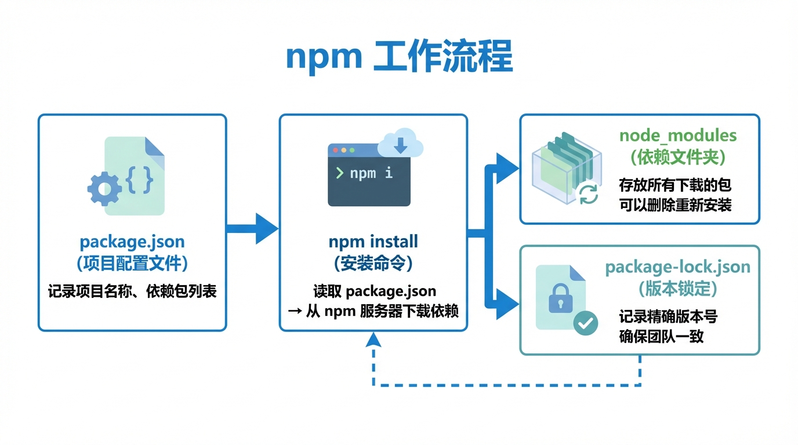

# 前端环境配置

> **方法论**：环境配好，项目能跑，就是成功。出错了复制报错问 AI。



---

## 📖 本节目标

学完本节，你将理解：
- ✅ Node.js 和 npm 是什么
- ✅ 怎么打开终端（命令行）
- ✅ 怎么看懂 package.json
- ✅ 如何配置国内镜像源（解决下载慢）
- ✅ 常用命令速查

**预计用时**：20 分钟

---

## 0. 终端是什么？怎么打开？

### 0.1 终端 = 用文字和电脑对话的窗口

**类比**：如果说鼠标点点点是"和电脑打手语"，那终端就是"和电脑说话"。

你在终端里输入命令（比如 `node -v`），电脑就会回复你结果。

### 0.2 如何打开终端？

**Windows 用户**：
1. 按键盘 `Win + R`
2. 输入 `cmd` 或 `powershell`
3. 按回车
4. 会弹出一个**黑色（或蓝色）窗口**

**Mac 用户**：
1. 按键盘 `Command + 空格`
2. 输入 `terminal` 或 `终端`
3. 按回车
4. 会弹出一个**白色（或黑色）窗口**

**它长这样**：
```
~ % _           ← 你会看到闪烁的光标，可以输入了
```

> **重要**：后面所有 `代码块` 里的命令，都是要在这个终端窗口里输入，不是在浏览器或 Word 里！

---

## 1. Node.js 和 npm

### 1.1 它们是什么？

| 名称 | 类比 | 通俗解释 |
|------|------|---------|
| **Node.js** | 厨房 | 以前 JS 只能在浏览器（前台）跑，现在有了 Node.js 这个厨房，JS 也能在后厨（你的电脑）做更多事 |
| **npm** | 应用商店 | 下载别人写好的代码包（比如做轮播图、处理日期的工具） |
| **npx** | 试用APP | 不用下载安装，直接运行一次某个工具（用完就扔） |

### 1.2 安装 Node.js

**推荐新手：官网下载**

1. 访问 [nodejs.org](https://nodejs.org/)
2. 下载 **LTS 版本**（长期支持，稳定）
   - 另一个 Current 版本是"尝鲜版"，可能有 bug，新手别碰
3. 双击安装包，一路点"下一步"

**验证安装**：

打开终端，输入：

```bash
node -v
```

如果显示类似 `v20.11.0`，就成功了！

如果显示 `command not found` 或报错：
- 重启终端再试一次
- 还不行就复制报错信息问 AI："我安装 Node.js 后输入 node -v 报错：[粘贴报错信息]"

再输入：
```bash
npm -v
```

显示类似 `10.2.4` 就 OK 了。

---

## 2. package.json 详解

### 2.1 这个文件是什么？

**package.json = 做菜的菜谱**

每个前端项目根目录都有这个文件，记录了：
- **项目名称和版本**（这道菜叫什么）
- **dependencies（依赖包）**：= **食材**（肉、菜，做好了端给客人吃必须有的）
- **devDependencies（开发依赖）**：= **厨具**（锅、铲子，做饭时需要，但客人吃的时候不用把锅端上去）
- **scripts（脚本命令）**：= **烹饪快捷键**（按一下按钮就自动炒菜）

> **Vibe Coding 提示**：看不懂 package.json 没关系，以后想加什么功能，直接告诉 AI："帮我在 package.json 里加上这个包"，让 AI 帮你改。

### 2.2 文件结构解读

```json
{
  "name": "my-app",              // 项目名称
  "version": "0.1.0",            // 版本号
  "private": true,               // 私有项目（不发布到 npm）

  "scripts": {                   // 👈 快捷命令
    "dev": "next dev",           // npm run dev → 启动开发服务器
    "build": "next build",       // npm run build → 打包项目
    "start": "next start",       // npm run start → 启动生产服务器
    "lint": "next lint"          // npm run lint → 检查代码
  },

  "dependencies": {              // 👈 食材（上线必须有）
    "next": "14.0.0",            // Next.js 框架
    "react": "^18.2.0",          // React 库
    "react-dom": "^18.2.0"       // React DOM 库
  },

  "devDependencies": {           // 👈 厨具（只在开发时用）
    "typescript": "^5.0.0",      // TypeScript（写代码时用，打包后就不需要了）
    "tailwindcss": "^3.3.0",     // Tailwind CSS（写样式时用）
    "@types/react": "^18.2.0"    // React 类型定义（开发时提示用）
  }
}
```

### 2.3 版本号含义

```
"react": "^18.2.0"
         │ │ │ │
         │ │ │ └─ 补丁版本（修 bug）
         │ │ └─── 次版本（加新功能，不影响旧代码）
         │ └───── 主版本（大改，可能不兼容旧代码）
         └─────── ^ 表示允许自动更新次版本和补丁版本
```

**你只需要记住**：`^` = "大约这个版本，允许小更新"

---

## 3. 配置国内镜像源（解决下载慢）

### 3.1 为什么要配置？

npm 默认从国外服务器下载，在国内可能：
- 下载很慢（几 KB/s）
- 经常超时失败

**解决办法**：切换到国内的淘宝镜像服务器。

### 3.2 配置淘宝镜像（推荐）

打开终端，输入：

```bash
npm config set registry https://registry.npmmirror.com
```

**验证配置**：

```bash
npm config get registry
```

如果显示 `https://registry.npmmirror.com`，就成功了！

以后下载包就会从国内服务器下载，飞快 🚀

### 3.3 恢复官方源（如果需要）

```bash
npm config set registry https://registry.npmjs.org
```

---

## 3. npm 常用命令

### 3.1 日常使用

```bash
# 安装所有依赖（根据 package.json）
npm install
# 或简写
npm i

# 运行开发服务器
npm run dev

# 构建生产版本
npm run build

# 运行生产版本
npm run start
```

### 3.2 管理依赖

```bash
# 安装新包（添加到 dependencies）
npm install axios
npm i axios

# 安装开发依赖（添加到 devDependencies）
npm install -D typescript
npm i -D typescript

# 安装指定版本
npm install react@18.2.0

# 卸载包
npm uninstall axios

# 更新包
npm update axios

# 查看已安装的包
npm list
npm list --depth=0  # 只看顶层
```

### 3.3 其他常用命令

```bash
# 清理缓存（遇到奇怪问题时尝试）
npm cache clean --force

# 查看全局安装的包
npm list -g --depth=0

# 查看包信息
npm info react

# 查看过时的包
npm outdated
```

---

## 4. 配置国内镜像源

### 4.1 为什么要配置？

npm 默认从国外服务器下载，在国内可能：
- 下载很慢
- 经常超时失败

### 4.2 配置淘宝镜像

**方法一：临时使用**

```bash
npm install --registry=https://registry.npmmirror.com
```

**方法二：永久配置（推荐）**

```bash
# 设置淘宝镜像
npm config set registry https://registry.npmmirror.com

# 验证配置
npm config get registry
# 应该显示：https://registry.npmmirror.com
```

**方法三：使用 nrm 管理多个源**

```bash
# 安装 nrm
npm install -g nrm

# 查看可用源
nrm ls

# 切换到淘宝源
nrm use taobao

# 切换回官方源
nrm use npm
```

### 4.3 恢复官方源

```bash
npm config set registry https://registry.npmjs.org
```

---

## 5. package-lock.json

### 5.1 这个文件是什么？

**package-lock.json = 依赖的"快照"**

- 记录了**所有依赖的精确版本**
- 确保团队成员安装完全相同的依赖
- **不要手动修改**，npm 自动管理

### 5.2 常见问题

**Q: 要不要提交到 Git？**
A: **要！** 这样其他人克隆项目后能安装完全相同的依赖。

**Q: package-lock.json 冲突了怎么办？**
```bash
# 删除后重新生成
rm package-lock.json
npm install
```

---

## 6. node_modules 文件夹

### 6.1 这是什么？

**node_modules = 依赖包的实际文件**

运行 `npm install` 后，所有依赖都下载到这个文件夹。

### 6.2 注意事项

- **非常大**（几百 MB 很正常）
- **不要提交到 Git**（已在 .gitignore 中排除）
- 删除后运行 `npm install` 可以重新生成

```bash
# 删除 node_modules（遇到问题时尝试）
rm -rf node_modules

# 重新安装
npm install
```

---

## 7. pnpm 和 yarn（替代方案）

### 7.1 为什么有替代品？

| 工具 | 特点 |
|------|------|
| **npm** | 官方，稳定，最通用 |
| **yarn** | Facebook 出品，安装更快 |
| **pnpm** | 最快，节省磁盘空间 |

### 7.2 pnpm 使用（推荐）

```bash
# 安装 pnpm
npm install -g pnpm

# 使用（命令几乎和 npm 一样）
pnpm install      # 安装依赖
pnpm add axios    # 添加依赖
pnpm dev          # 运行脚本（不需要 run）
```

### 7.3 yarn 使用

```bash
# 安装 yarn
npm install -g yarn

# 使用
yarn              # 安装依赖
yarn add axios    # 添加依赖
yarn dev          # 运行脚本
```

---

## 8. 命令速查表

### 日常开发

| 操作 | npm | pnpm | yarn |
|------|-----|------|------|
| 安装依赖 | `npm install` | `pnpm install` | `yarn` |
| 运行开发 | `npm run dev` | `pnpm dev` | `yarn dev` |
| 构建 | `npm run build` | `pnpm build` | `yarn build` |
| 添加包 | `npm i axios` | `pnpm add axios` | `yarn add axios` |
| 删除包 | `npm uninstall axios` | `pnpm remove axios` | `yarn remove axios` |

### 创建项目

```bash
# Next.js 项目
npx create-next-app@latest my-app

# Vite + React 项目
npm create vite@latest my-app -- --template react

# 使用 pnpm 创建
pnpm create next-app my-app
```

---

## 📝 小结

| 概念 | 说明 |
|------|------|
| Node.js | JavaScript 运行环境 |
| npm | 包管理器，下载和管理依赖 |
| package.json | 项目配置文件 |
| package-lock.json | 依赖版本快照 |
| node_modules | 依赖包的实际文件 |

**Vibe Coder 记住这些就够了**：
1. `npm install` - 安装依赖
2. `npm run dev` - 启动开发
3. `npm run build` - 构建项目
4. 下载慢就配置淘宝镜像
5. 报错了复制错误信息问 AI

---

## 📚 下一步

👉 [前端概述](./前端概述.md)

了解 HTML、CSS、JavaScript 三件套的基本概念。

返回 [前端开发基础](./README.md) 查看完整目录。
