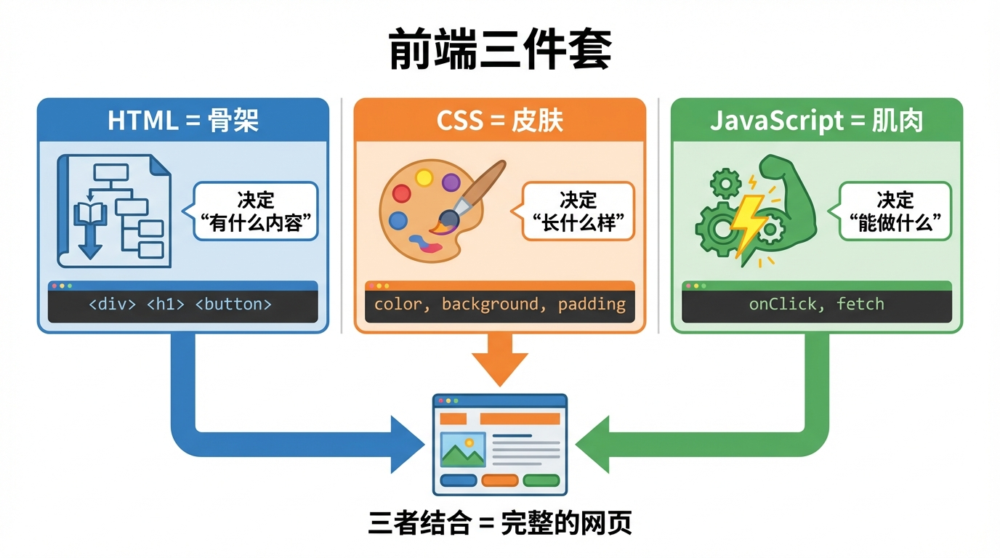

# 前端概述:网页是怎么"画"出来的?

> **方法论**:不求精通,但求能跑。先看懂结构,再让 AI 帮你写。



---

## 📖 本节目标

学完本节,你将理解:
- ✅ 前端是什么,干什么用
- ✅ HTML、CSS、JavaScript 分别是什么
- ✅ 它们如何配合工作
- ✅ 如何动手运行第一个网页

**预计用时**:20 分钟

---

## 1. 前端是什么?

### 一句话解释

**前端 = 你在浏览器里看到的一切**

打开任何网站(淘宝、微信、B站),你看到的:
- 页面布局
- 按钮、图片、文字
- 点击后的动画效果

这些都是前端负责的。

### 前端 vs 后端

| 前端 | 后端 |
|------|------|
| 用户能看到的界面 | 用户看不到的逻辑 |
| 在浏览器运行 | 在服务器运行 |
| HTML/CSS/JS | Python/Java/Go |
| 负责"长什么样" | 负责"数据从哪来" |

**类比**:
- 前端 = 餐厅的装修和菜单
- 后端 = 厨房和厨师

---

## 2. 前端三件套

### 2.1 HTML = 骨架

**HTML(超文本标记语言)** 决定页面**有什么内容**。

```html
<!-- 这是一个简单的 HTML 结构 -->
<div>
  <h1>欢迎来到我的网站</h1>
  <p>这是一段介绍文字</p>
  <button>点击我</button>
</div>
```

**常见标签**:

| 标签 | 作用 | 例子 |
|------|------|------|
| `<div>` | 容器,装东西 | 整个卡片 |
| `<h1>~<h6>` | 标题 | 页面大标题 |
| `<p>` | 段落 | 正文内容 |
| `<button>` | 按钮 | 提交按钮 |
| `` | 图片 | 商品图 |
| `<a>` | 链接 | 跳转其他页面 |
| `<input>` | 输入框 | 搜索框、表单 |

**记住**:HTML 只管"有什么",不管"好不好看"。

---

### 2.2 CSS = 皮肤

**CSS(层叠样式表)** 决定页面**长什么样**。

```css
/* 这是 CSS 样式 */
.card {
  background: white;      /* 背景色 */
  padding: 20px;          /* 内边距 */
  border-radius: 8px;     /* 圆角 */
  box-shadow: 0 2px 4px rgba(0,0,0,0.1);  /* 阴影 */
}

.title {
  font-size: 24px;        /* 字号 */
  color: #333;            /* 颜色 */
  font-weight: bold;      /* 加粗 */
}
```

#### CSS 盒子模型(重要!)

**padding(内边距) vs margin(外边距) 的区别**:

```
想象一个快递盒子📦:

┌─────────────────────────────┐
│   margin(外边距)              │  ← 盒子和其他盒子之间的距离
│   ┌─────────────────────┐  │
│   │ border(边框)         │  │  ← 盒子的边
│   │ ┌─────────────────┐ │  │
│   │ │ padding(内边距) │ │  │  ← 边框到内容的距离
│   │ │ ┌─────────────┐ │ │  │
│   │ │ │   内容区    │ │ │  │  ← 文字、图片等
│   │ │ │ (content)   │ │ │  │
│   │ │ └─────────────┘ │ │  │
│   │ └─────────────────┘ │  │
│   └─────────────────────┘  │
└─────────────────────────────┘
```

**通俗理解**:
- **padding(内边距)** = 快递盒里面的泡沫(保护里面的东西不被挤到边框)
- **margin(外边距)** = 盒子和盒子之间要留的空隙(别挤在一起)

**常用属性**:

| 属性 | 作用 | 常用值 |
|------|------|--------|
| `color` | 文字颜色 | `#333`, `red` |
| `background` | 背景 | `white`, `#f5f5f5` |
| `font-size` | 字号 | `16px`, `1.5rem` |
| `padding` | 内边距(盒子内部留白) | `10px`, `20px` |
| `margin` | 外边距(盒子外部留白) | `10px`, `auto` |
| `border-radius` | 圆角 | `4px`, `50%` |
| `display` | 布局方式 | `flex`, `grid` |

**记住**:CSS 只管"好不好看",不管"能不能动"。

---

### 2.3 JavaScript = 肌肉

**JavaScript(JS)** 决定页面**能做什么**。

```javascript
// 点击按钮后弹出提示
function handleClick() {
  alert('你点击了按钮!')
}

// 修改页面内容
document.getElementById('title').innerText = '新标题'
```

> **Vibe Coding 提示**:作为 Vibe Coder,你**不需要完全看懂**这些 JS 代码。你只需要知道:
> - `function handleClick()` = 定义一个"点击后要做的事"
> - `alert()` = 弹出提示框
> - `document.getElementById()` = 找到页面上的某个元素并修改它
>
> 具体怎么写?交给 AI!你只要能看出来"这段代码是干嘛的"就够了。

**常见用途**:

| 功能 | 例子 |
|------|------|
| 响应用户操作 | 点击按钮、提交表单 |
| 修改页面内容 | 显示/隐藏元素、更新文字 |
| 网络请求 | 从服务器获取数据 |
| 动画效果 | 轮播图、弹窗 |
| 表单验证 | 检查邮箱格式、密码强度 |

**记住**:JavaScript 让页面"活"起来。

---

## 3. 三件套如何配合?

### 一个完整的例子

```html
<!-- HTML:结构 -->
<div class="card">
  <h1 class="title">商品名称</h1>
  <p class="price">¥99</p>
  <button onclick="addToCart()">加入购物车</button>
</div>

<style>
/* CSS:样式 */
.card {
  background: white;
  padding: 20px;
  border-radius: 8px;
}
.title {
  font-size: 18px;
  color: #333;
}
.price {
  color: #ff4d4f;
  font-size: 24px;
}
button {
  background: #1890ff;
  color: white;
  padding: 10px 20px;
  border: none;
  border-radius: 4px;
  cursor: pointer;
}
</style>

<script>
// JavaScript:交互
function addToCart() {
  alert('已加入购物车!')
}
</script>
```

### 职责分工

```
HTML  → 定义了:一个卡片、标题、价格、按钮
CSS   → 决定了:白色背景、圆角、蓝色按钮
JS    → 实现了:点击按钮弹出提示
```

---

## 4. 动手试一试!

### 4.1 运行你的第一个网页

> **终于可以动手了!** 让我们把上面那个"购物车"例子跑起来看看效果。

**步骤 1**:打开 VS Code(或任何文本编辑器)

**步骤 2**:新建一个文件,命名为 `test.html`(注意后缀是 `.html`)

**步骤 3**:复制下面的完整代码,粘贴进去,保存

```html
<!DOCTYPE html>
<html lang="zh-CN">
<head>
  <meta charset="UTF-8">
  <title>我的第一个网页</title>
  <style>
    body {
      font-family: Arial, sans-serif;
      padding: 40px;
      background: #f5f5f5;
    }
    .card {
      background: white;
      padding: 20px;
      border-radius: 8px;
      max-width: 300px;
      box-shadow: 0 2px 8px rgba(0,0,0,0.1);
    }
    .title {
      font-size: 20px;
      color: #333;
      margin-bottom: 10px;
    }
    .price {
      color: #ff4d4f;
      font-size: 28px;
      font-weight: bold;
      margin-bottom: 20px;
    }
    button {
      background: #1890ff;
      color: white;
      padding: 12px 24px;
      border: none;
      border-radius: 4px;
      cursor: pointer;
      width: 100%;
      font-size: 16px;
    }
    button:hover {
      background: #096dd9;
    }
  </style>
</head>
<body>
  <div class="card">
    <div class="title">iPhone 15 Pro</div>
    <div class="price">¥8999</div>
    <button onclick="addToCart()">加入购物车</button>
  </div>

  <script>
    function addToCart() {
      alert('恭喜!已成功加入购物车!🎉')
    }
  </script>
</body>
</html>
```

**步骤 4**:找到这个 `test.html` 文件,双击打开(会用浏览器打开)

**步骤 5**:点击"加入购物车"按钮,看到弹窗了吗?🎉

> **成就解锁!** 你已经成功运行了你的第一个网页!虽然简单,但麻雀虽小五脏俱全——HTML、CSS、JS 三件套全都用上了。

### 4.2 试试修改样式

现在你可以试试改点东西,比如:

**改颜色**:
```css
button {
  background: #52c41a;  /* 把蓝色改成绿色 */
}
```

**改价格**:
```html
<div class="price">¥6999</div>  <!-- 改个便宜点的价格 -->
```

**改提示文字**:
```javascript
alert('太好了!商品已加入购物车!🛒')
```

每次修改后,保存文件,刷新浏览器页面(按 F5),就能看到效果!

---

## 5. 现代前端开发

### 为什么不一直写 HTML 文件?

你可能会想:"既然 HTML 文件这么简单,为啥还要学框架?"

**原因**:

| 问题 | 例子 |
|------|------|
| **代码难以复用** | 10 个页面都要复制粘贴同样的导航栏代码 |
| **项目大了难维护** | 改个按钮颜色,要改 50 个文件 |
| **没有组件化概念** | 不能像搭积木一样组装页面 |

所以出现了**前端框架**:

| 框架 | 特点 | 适合场景 |
|------|------|---------|
| **React** | 组件化、生态最大 | 中大型项目 |
| Vue | 易上手、中文文档好 | 中小型项目 |
| Angular | 企业级、功能全面 | 大型企业项目 |

### 我们的选择:Next.js

**类比**:
- 写 HTML/CSS/JS = 从面粉、肉、菜开始做菜(累且慢)
- 用 Next.js = 用预制菜/料理包(配好料,下锅就能吃)

**Next.js = React + 很多开箱即用的功能**

- 文件即路由(不用配置,创建文件就是创建页面)
- 自动优化(不用操心性能,框架自动帮你做好)
- Vercel 一键部署(免费且简单,几分钟上线)
- AI 最熟悉(GitHub 代码最多,AI 生成质量最高)

---

## 6. Vibe Coding 视角

### 你需要记住的

作为 Vibe Coder,你**不需要**:
- ❌ 背诵所有 HTML 标签
- ❌ 精通 CSS 所有属性
- ❌ 手写复杂 JavaScript

你**需要**:
- ✅ 理解三件套的分工
- ✅ 能看懂 AI 生成的代码
- ✅ 知道哪里出了问题该问什么

### 遇到问题怎么办?

**场景 1**:页面内容不对
→ 检查 HTML,看标签和文字

**场景 2**:样式不对(颜色、大小、位置)
→ 检查 CSS,或问 AI:"这个按钮怎么改成红色?"

**场景 3**:点击没反应
→ 检查 JavaScript,或问 AI:"点击按钮后怎么跳转页面?"

### 如何向 AI 提问(实用技巧)

**问法 1:直接粘贴代码+说需求**
```
[粘贴你的代码]

这个按钮我想改成圆角的,而且鼠标悬停时变成深蓝色,怎么改?
```

**问法 2:描述效果**
```
我想做一个卡片,白色背景,有圆角和阴影,里面有标题、价格和按钮。
用 HTML 和 CSS 帮我写一下。
```

**问法 3:报错求助**
```
我的按钮点击没反应,代码是:
[粘贴代码]

帮我看看哪里错了。
```

> **Vibe Coding 核心**:不会写代码没关系,会"说人话"描述需求就够了。AI 会把你的需求翻译成代码。

---

## 📝 小结

| 技术 | 比喻 | 职责 |
|------|------|------|
| HTML | 骨架 | 页面有什么内容 |
| CSS | 皮肤 | 页面长什么样 |
| JavaScript | 肌肉 | 页面能做什么 |

**核心理解**:
1. 前端 = 浏览器里看到的一切
2. 三件套各司其职,缺一不可
3. 小项目可以直接写 HTML 文件练手
4. 真正做项目用框架(React/Next.js)提高效率
5. Vibe Coding 重点是理解结构,让 AI 帮你写代码

---

## 📚 下一步

👉 [Next.js 快速入门](./03_nextjs入门.md)

学习如何用 Next.js 创建你的第一个项目(告别单个 HTML 文件,开始真正的前端开发)。

返回 [前端开发基础](./README.md) 查看完整目录。
