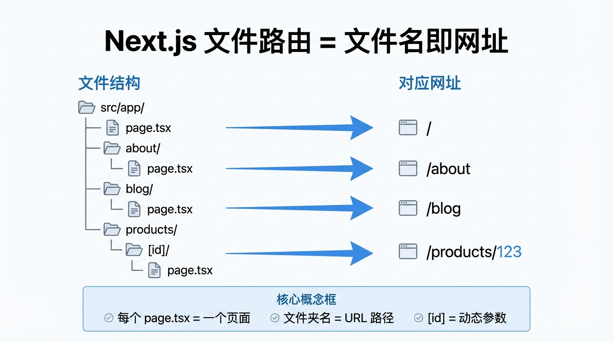

# Next.js 快速入门

> **方法论**:文件名即路由,创建文件就是创建页面。

---

## 📖 本节目标

学完本节,你将能够:
- ✅ 创建一个 Next.js 项目
- ✅ 理解项目文件结构
- ✅ 创建新页面和路由
- ✅ 运行和预览项目

**预计用时**:25 分钟

---

## 0. 开始前的准备(重要!)

### 0.1 不要慌!

如果你看到 `.tsx`、`TypeScript`、`React.ReactNode` 这些陌生词汇感到害怕——**这很正常!**

> **Vibe Coding 心法**:
> - `.tsx` 文件 = 高级版的 HTML,写法几乎一样
> - TypeScript = JavaScript 的安全版,AI 会帮你处理
> - 那些复杂的类型标注(如 `React.ReactNode`)? **全部交给 AI 写,你不用管!**
>
> 你只需要:
> 1. 理解页面的**结构**
> 2. 知道**文件放哪里**
> 3. 会用**文件树操作**(不会命令行也没关系)

---

## 1. 为什么选择 Next.js?

### 对比其他方案

| 方案 | 优点 | 缺点 |
|------|------|------|
| 纯 HTML | 简单 | 无法复用,难维护 |
| React | 组件化 | 需要配置路由、打包 |
| **Next.js** | 开箱即用,零配置 | 学习曲线略高 |

### Next.js 的优势

| 特点 | 说明 | 对你的好处 |
|------|------|-----------|
| 文件路由 | 文件名 = 网址 | 不用配置,直接创建文件 |
| 自动优化 | 代码分割、图片优化 | 不用操心性能 |
| API 路由 | 可以写后端接口 | 前后端一个项目搞定 |
| Vercel 部署 | 一键部署 | 免费且简单 |
| AI 友好 | GitHub 代码最多 | AI 生成代码质量最高 |

---

## 2. 创建项目(手把手教学)

### 2.1 打开终端

**Windows**:按 `Win + R`,输入 `cmd`,回车
**Mac**:按 `Command + 空格`,输入 `终端`,回车

### 2.2 一键创建

在终端里输入(或复制粘贴)这行命令,然后按回车:

```bash
npx create-next-app@latest my-app
```

> **提示**:如果下载慢,参考[环境配置](./01_环境配置.md)里的镜像源设置。

### 2.3 回答几个问题(别慌!)

接下来终端会问你几个问题。**不用紧张,按照下面的步骤操作**:

```
✔ Would you like to use TypeScript? › No / Yes
```
**操作**:用**方向键 ↑↓** 移动光标到 `Yes`,然后按**回车**

**为什么选 Yes?** TypeScript 虽然听起来高级,但 AI 更擅长写它,你会更轻松。

---

```
✔ Would you like to use ESLint? › No / Yes
```
**操作**:选 `Yes`,按回车

**什么是 ESLint?** 自动检查代码错误的工具,别管它,选上就对了。

---

```
✔ Would you like to use Tailwind CSS? › No / Yes
```
**操作**:选 `Yes`,按回车

**什么是 Tailwind?** 写样式的利器,后面会学到。

---

```
✔ Would you like your code inside a `src/` directory? › No / Yes
```
**操作**:选 `Yes`,按回车

**为什么?** 代码放在 `src` 文件夹里更整洁。

---

```
✔ Would you like to use App Router? › No / Yes
```
**操作**:选 `Yes`,按回车

**这是什么?** Next.js 的新路由方式,本教程就是教这个。

---

```
✔ Would you like to use Turbopack for next dev? › No / Yes
```
**操作**:选 `Yes`,按回车

**作用?** 让开发服务器跑得更快,选上没坏处。

---

```
✔ Would you like to customize the import alias? › No / Yes
```
**操作**:选 `No`,按回车

**什么意思?** 高级功能,新手不用管。

---

> **总结一下**:除了最后一个选 `No`,其他全选 `Yes`。如果你嫌麻烦,一路狂按回车也行(默认都是推荐选项)。

### 2.4 等待安装

终端会开始下载和安装一堆东西,看到类似这样的输出就对了:

```
Creating a new Next.js app in /Users/xxx/my-app...
Installing dependencies...
```

**时间**:大概 1-3 分钟(国内网络慢的话可能更久)
**不要关闭终端**,等它跑完就行。

---

## 3. 启动项目

### 3.1 进入项目文件夹

```bash
cd my-app
```

> **注意**:这里的 `my-app` 就是你刚才创建的项目名。

### 3.2 启动开发服务器

```bash
npm run dev
```

**成功的标志**:终端会显示类似这样的内容:

```
   ▲ Next.js 15.x.x
   - Local:        http://localhost:3000
   - Network:      http://192.168.x.x:3000

 ✓ Starting...
 ✓ Ready in 2.3s
```

> **成就解锁!** 看到 `Ready` 就说明成功了!

### 3.3 在浏览器打开

打开浏览器(Chrome、Edge、Safari 都行),在地址栏输入:

```
http://localhost:3000
```

**你会看到**:一个酷炫的 Next.js 欢迎页面!🎉

> **小贴士**:
> - `localhost` = 你自己的电脑
> - `3000` = 端口号(别管它是啥,记住就行)
> - 开发时这个终端**不要关**,关了网站就打不开了

---

## 4. 项目文件结构(用 VS Code 看)

### 4.1 用 VS Code 打开项目

**方法 1**:在终端输入(确保你在 `my-app` 文件夹里):
```bash
code .
```

**方法 2**:打开 VS Code → 文件 → 打开文件夹 → 选择 `my-app`

### 4.2 看看文件结构

打开后,左边会显示文件树,长这样:

```
my-app/
├── src/
│   └── app/                    # 👈 核心:你的页面都放这里
│       ├── layout.tsx          # 全局布局(导航、页脚)
│       ├── page.tsx            # 首页内容
│       ├── globals.css         # 全局样式
│       └── favicon.ico         # 网站小图标
├── public/                     # 图片等静态文件放这里
├── package.json                # 项目配置(别乱改)
├── tailwind.config.ts          # Tailwind 配置(别管)
└── next.config.ts              # Next.js 配置(别管)
```

> **Vibe Coding 提示**:90% 的时间你只需要在 `src/app` 文件夹里干活。其他文件?**当它们不存在就行了。**

### 4.3 最重要的 3 个文件

| 文件 | 作用 | 你会做的事 |
|------|------|----------|
| `src/app/page.tsx` | 首页(/) | 改这里就改首页 |
| `src/app/layout.tsx` | 所有页面的"外壳" | 加导航、页脚就改这里 |
| `src/app/globals.css` | 全局样式 | Tailwind 引入在这里,一般不用动 |

---

## 5. 文件路由系统(核心!)

### 5.1 核心规则:文件名 = 网址



**比喻**:想象你在整理书架📚

```
src/app/
├── page.tsx              → 首页(/)              【主书架】
├── about/
│   └── page.tsx          → /about 页面          【关于我们】书架
└── products/
    ├── page.tsx          → /products 页面       【产品列表】书架
    └── [id]/
        └── page.tsx      → /products/123 页面   【具体产品】书架
```

**规则很简单**:
1. 文件夹名 = 网址的一部分
2. 必须叫 `page.tsx` 才能被访问
3. `[id]` 这种方括号 = 动态的(任何数字都能匹配)

---

### 5.2 动手创建一个新页面

**需求**:创建一个"关于我"页面,网址是 `/about`

#### 方法 1:用 VS Code 文件树(推荐小白)

1. 在 VS Code 左边,右键点击 `src/app` 文件夹
2. 选择"新建文件夹" → 输入 `about`
3. 右键点击刚建的 `about` 文件夹
4. 选择"新建文件" → 输入 `page.tsx`

#### 方法 2:用终端命令(可选)

```bash
mkdir -p src/app/about
```

然后再在 VS Code 里创建 `page.tsx` 文件。

---

#### 写点内容

打开 `src/app/about/page.tsx`,输入(或让 AI 帮你写):

```tsx
export default function AboutPage() {
  return (
    <div className="p-8">
      <h1 className="text-3xl font-bold">关于我</h1>
      <p className="mt-4 text-gray-600">
        这是我的个人网站,用 Next.js 搭建。
      </p>
    </div>
  )
}
```

> **代码解释**:
> - `export default function AboutPage()` = 定义一个页面组件(固定格式,AI 会帮你写)
> - `return (...)` = 返回要显示的内容
> - `className="..."` = Tailwind 样式类(下一章会学)

**保存后**,打开浏览器访问 `http://localhost:3000/about`,你的页面就出现了!🎉

---

### 5.3 常见路由示例

| 需求 | 创建的文件 | 对应网址 |
|------|----------|---------|
| 产品列表页 | `src/app/products/page.tsx` | `/products` |
| 产品详情页(动态) | `src/app/products/[id]/page.tsx` | `/products/123` |
| 用户设置页 | `src/app/settings/page.tsx` | `/settings` |
| 博客文章详情 | `src/app/blog/[slug]/page.tsx` | `/blog/my-first-post` |

---

## 6. Layout:所有页面的"相框"

### 6.1 Layout 是什么?

**比喻**:Layout 就像一个**相框🖼️**

```
┌─────────────────────────────┐
│      导航栏(固定)             │  ← Layout 的一部分
├─────────────────────────────┤
│                              │
│                              │
│      这里是 page.tsx         │  ← 不同页面的内容
│      (每个页面不一样)         │
│                              │
│                              │
├─────────────────────────────┤
│      页脚(固定)              │  ← Layout 的一部分
└─────────────────────────────┘
```

**核心理解**:
- **Layout** = 相框(导航栏、页脚,所有页面共享)
- **Page** = 照片(每个页面不同的内容)

---

### 6.2 实际例子

打开 `src/app/layout.tsx`,你会看到类似这样的代码:

```tsx
export default function RootLayout({
  children,
}: {
  children: React.ReactNode
}) {
  return (
    <html lang="zh-CN">
      <body>
        {/* 这里可以加导航栏 */}
        <nav className="bg-gray-800 text-white p-4">
          网站导航
        </nav>

        {children}  {/* 👈 这里会显示 page.tsx 的内容 */}

        {/* 这里可以加页脚 */}
        <footer className="bg-gray-100 p-4 text-center">
          © 2024 我的网站
        </footer>
      </body>
    </html>
  )
}
```

> **Vibe Coding 提示**:
> - `{children}` = 一个占位符,表示"这里显示具体页面的内容"
> - `React.ReactNode`、`children: React.ReactNode` 这些?**别管!** 让 AI 帮你写就行,你只需要知道在哪里加导航和页脚。

---

## 7. 页面跳转

### 7.1 用 Link 组件

**需求**:在首页加个链接,点击后跳到"关于我"页面

打开 `src/app/page.tsx`,修改成:

```tsx
import Link from 'next/link'

export default function HomePage() {
  return (
    <div className="p-8">
      <h1 className="text-3xl font-bold">欢迎来到我的网站</h1>
      <Link
        href="/about"
        className="text-blue-500 hover:underline mt-4 inline-block"
      >
        了解更多关于我
      </Link>
    </div>
  )
}
```

**保存**,刷新浏览器,点击链接试试!

> **核心**:
> - `import Link from 'next/link'` = 引入 Link 组件
> - `<Link href="/about">` = 跳转到 `/about` 页面
> - 就这么简单,不用 `<a>` 标签了

---

## 8. 实战练习:做个三页网站

### 目标

创建一个有 3 个页面的网站:
1. 首页 `/`
2. 关于页 `/about`
3. 联系页 `/contact`

并且在导航栏加上这 3 个链接,所有页面都能看到。

---

### 步骤 1:创建文件

用 VS Code 文件树(右键→新建文件夹→新建文件)创建:

```
src/app/
├── page.tsx             (已有,首页)
├── about/
│   └── page.tsx         (新建)
└── contact/
    └── page.tsx         (新建)
```

---

### 步骤 2:写内容

**首页** `src/app/page.tsx`:

```tsx
export default function HomePage() {
  return (
    <div className="p-8">
      <h1 className="text-3xl font-bold">欢迎来到我的网站</h1>
      <p className="mt-4 text-gray-600">
        这是用 Next.js 搭建的个人网站。
      </p>
    </div>
  )
}
```

**关于页** `src/app/about/page.tsx`:

```tsx
export default function AboutPage() {
  return (
    <div className="p-8">
      <h1 className="text-3xl font-bold">关于我</h1>
      <p className="mt-4 text-gray-600">
        我是一个正在学习 Vibe Coding 的开发者。
      </p>
    </div>
  )
}
```

**联系页** `src/app/contact/page.tsx`:

```tsx
export default function ContactPage() {
  return (
    <div className="p-8">
      <h1 className="text-3xl font-bold">联系我</h1>
      <p className="mt-4 text-gray-600">
        邮箱:hello@example.com
      </p>
    </div>
  )
}
```

---

### 步骤 3:添加导航栏

打开 `src/app/layout.tsx`,改成这样:

```tsx
import Link from 'next/link'
import './globals.css'

export default function RootLayout({
  children,
}: {
  children: React.ReactNode
}) {
  return (
    <html lang="zh-CN">
      <body>
        {/* 导航栏 */}
        <nav className="bg-blue-600 text-white p-4">
          <div className="flex gap-6">
            <Link href="/" className="hover:underline">首页</Link>
            <Link href="/about" className="hover:underline">关于</Link>
            <Link href="/contact" className="hover:underline">联系</Link>
          </div>
        </nav>

        {/* 页面内容 */}
        <main>
          {children}
        </main>

        {/* 页脚 */}
        <footer className="bg-gray-100 p-4 text-center text-gray-600">
          © 2024 我的网站
        </footer>
      </body>
    </html>
  )
}
```

**保存**,刷新浏览器,点击导航栏的链接试试!🎉

---

## 9. 常用命令速查

| 命令 | 作用 | 什么时候用 |
|------|------|----------|
| `npm run dev` | 启动开发服务器 | 开发时一直开着 |
| `npm run build` | 构建生产版本 | 准备上线前用 |
| `npm run start` | 运行生产版本 | 部署到服务器时用 |
| `npm run lint` | 检查代码规范 | 有时会报错,一般不用管 |

> **小白提示**:90% 的时间你只用 `npm run dev` 这一个命令。

---

## 10. Vibe Coding 技巧

### 10.1 让 AI 帮你创建页面

当你想加新页面时,别自己写,直接问 AI:

**Prompt 示例**:

```
帮我创建一个 Next.js 页面:
- 路径:/products
- 内容:显示 3 个产品卡片,包括图片、名称、价格
- 样式:用 Tailwind CSS,白色背景,圆角卡片
```

AI 会直接给你完整代码,你只需要:
1. 创建 `src/app/products/page.tsx` 文件
2. 把代码复制进去
3. 保存,刷新浏览器,搞定!

---

### 10.2 遇到问题怎么问

**问题 1**:访问 `/about` 显示 404

```
我的 about 页面访问不了,显示 404。
我创建的文件路径是:src/app/about/page.tsx
代码是:[粘贴你的代码]
请帮我看看哪里错了。
```

---

**问题 2**:想让所有页面都有导航栏

```
我想在所有页面顶部加个导航栏,包含"首页"、"关于"、"联系"三个链接。
应该改哪个文件?怎么改?
```

---

**问题 3**:不知道文件该放哪

```
我想创建一个用户个人主页,网址是 /user/profile。
我应该在哪里创建文件?文件名叫什么?
```

---

## 📝 小结

| 概念 | 说明 | 记住这一句 |
|------|------|----------|
| 文件路由 | `src/app/xxx/page.tsx` → `/xxx` | 文件夹名=网址 |
| Layout | 所有页面的"相框"(导航、页脚) | 共用的东西放这里 |
| Page | 每个页面不同的内容 | 必须叫 `page.tsx` |
| Link | 页面跳转组件 | 替代 `<a>` 标签 |

**核心理解**:
1. Next.js 用文件结构决定网址,不需要配置路由
2. 创建页面 = 创建 `xxx/page.tsx` 文件
3. Layout 是"相框",Page 是"照片"
4. 复杂的类型标注(`React.ReactNode` 等)交给 AI 写,你不用管

---

## 📚 下一步

👉 [Tailwind CSS 快速入门](./04_tailwind入门.md)

学习如何用 Tailwind CSS 快速写出好看的样式,让你的网站变漂亮。

返回 [前端开发基础](./README.md) 查看完整目录。
