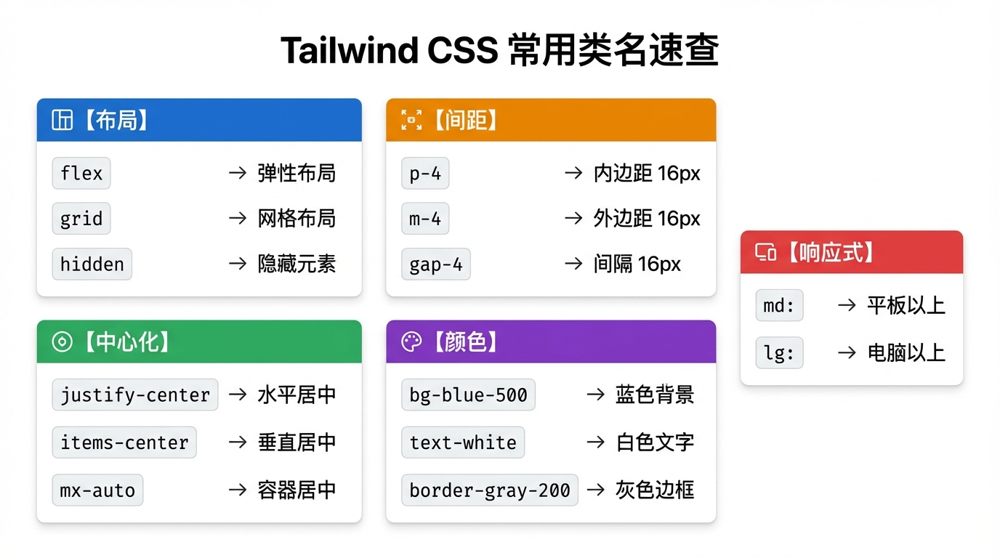

# Tailwind CSS 快速入门

> **方法论**:不背类名,用到就查。AI 最擅长写 Tailwind。

---

## 📖 本节目标

学完本节,你将能够:
- ✅ 理解 Tailwind CSS 的核心思想
- ✅ 掌握最常用的 20 个类名
- ✅ 实现响应式设计
- ✅ 快速调整组件样式

**预计用时**:25 分钟

---

## 0. 开始前必看(重要!)

### 0.1 Next.js 里必须用 `className`!

> **⚠️ 超级重要!**
>
> 在 **Next.js/React** 项目里,HTML 属性 `class` 要写成 `className`(驼峰命名)。
>
> **错误写法**:
> ```tsx
> <div class="bg-blue-500">  ❌ 会报错!
> ```
>
> **正确写法**:
> ```tsx
> <div className="bg-blue-500">  ✅ 这才对!
> ```
>
> **为什么?** 因为 `class` 在 JavaScript 里是保留关键字,React 用 `className` 避免冲突。

**本教程的所有代码示例都用 `className`,可以直接复制到 Next.js 项目里使用。**

### 0.2 推荐安装 VS Code 插件

**Tailwind CSS IntelliSense** - 神器!

**安装方法**:
1. 打开 VS Code
2. 点击左边的扩展图标(四个方块)
3. 搜索 `Tailwind CSS IntelliSense`
4. 点击安装

**安装后的好处**:
- 鼠标悬停类名,显示实际 CSS 值
- 自动补全类名(打 `bg-` 会提示所有背景色)
- 颜色类名旁边显示色块🎨

---

## 1. Tailwind 是什么?

### 一句话解释

**Tailwind = 把 CSS 写成类名**

**比喻**:Tailwind 就像 **乐高积木🧱**

- 传统 CSS = 自己捏泥巴(想捏啥样捏啥样,但容易塌)
- Tailwind = 给你准备好的积木块(各种形状和颜色),你只需要拼起来

传统 CSS:
```css
.button {
  background-color: blue;
  color: white;
  padding: 10px 20px;
  border-radius: 8px;
}
```

Tailwind:
```tsx
<button className="bg-blue-500 text-white px-5 py-2 rounded-lg">
  按钮
</button>
```

### 为什么用 Tailwind?

| 传统 CSS | Tailwind |
|----------|----------|
| 需要起类名 | 不用起名 |
| 写在单独文件 | 直接写在 HTML |
| 改样式要切换文件 | 改样式就在当前位置 |
| AI 生成效率低 | AI 生成效率极高 |

**对 Vibe Coder 的好处**:让 AI 生成 Tailwind 代码,效果又快又好。

---

## 2. 最常用的 20 个类名



### 2.1 布局类

| 类名 | 作用 | CSS 等价 |
|------|------|---------  |
| `flex` | 弹性布局 | `display: flex` |
| `grid` | 网格布局 | `display: grid` |
| `hidden` | 隐藏 | `display: none` |
| `block` | 块级元素 | `display: block` |

#### Flex 布局详解(重要!)

**Flex = 让元素排队站好**

```
┌─────────────────────────────┐
│  ┌──┐  ┌──┐  ┌──┐          │  ← justify-center (水平居中)
│  │1 │  │2 │  │3 │          │
│  └──┘  └──┘  └──┘          │
└─────────────────────────────┘

┌─────────────────────────────┐
│         ┌──┐                │
│         │1 │  ← items-center │  ← items-center (垂直居中)
│         └──┘                │
└─────────────────────────────┘
```

**记忆口诀**:
- `justify-*` = 管**横着**(水平方向)
- `items-*` = 管**竖着**(垂直方向)

**常用组合**:

```tsx
{/* 水平居中 */}
<div className="flex justify-center">内容</div>

{/* 垂直居中 */}
<div className="flex items-center">内容</div>

{/* 水平+垂直居中(完美居中) */}
<div className="flex justify-center items-center">内容</div>

{/* 两端对齐 */}
<div className="flex justify-between">
  <span>左边</span>
  <span>右边</span>
</div>
```

### 2.2 间距类

| 类名 | 作用 | 数值说明 |
|------|------|---------  |
| `p-4` | 内边距 | 4 = 16px |
| `px-4` | 左右内边距 | x = 水平方向 |
| `py-4` | 上下内边距 | y = 垂直方向 |
| `m-4` | 外边距 | m = margin |
| `mx-auto` | 水平居中 | auto = 自动 |
| `gap-4` | 元素间距 | 用于 flex/grid |

#### 数值规律(记住这个公式!)

**公式**: `数字 × 4 = 像素数`

| Tailwind | 像素 | 计算 |
|----------|------|------|
| `p-1` | 4px | 1 × 4 |
| `p-2` | 8px | 2 × 4 |
| `p-4` | 16px | 4 × 4 |
| `p-6` | 24px | 6 × 4 |
| `p-8` | 32px | 8 × 4 |
| `p-10` | 40px | 10 × 4 |

> **Vibe Coding 提示**:想写 `15px` 这种不规则数字?
>
> **方法 1**(推荐):告诉 AI "我想要 15px 的内边距",AI 会用 `p-[15px]` 这种自定义值写法。
>
> **方法 2**:用最接近的数字,比如 15px ≈ `p-4`(16px),差 1px 肉眼看不出来。

```tsx
{/* 卡片内边距 */}
<div className="p-6">卡片内容</div>

{/* 按钮内边距 */}
<button className="px-4 py-2">按钮</button>

{/* 容器居中 */}
<div className="mx-auto max-w-4xl">内容</div>
```

### 2.3 颜色类

| 类名 | 作用 |
|------|------|
| `bg-blue-500` | 背景色 |
| `text-white` | 文字颜色 |
| `border-gray-200` | 边框颜色 |

**颜色深度**:100(最浅)→ 900(最深)

```tsx
{/* 蓝色按钮 */}
<button className="bg-blue-500 text-white">按钮</button>

{/* 灰色背景 */}
<div className="bg-gray-100">内容</div>

{/* 红色文字 */}
<span className="text-red-500">错误提示</span>
```

**常用颜色**:

| 颜色 | 用途 |
|------|------|
| `blue-500` | 主色调、链接 |
| `gray-100~900` | 背景、边框、文字 |
| `red-500` | 错误、警告 |
| `green-500` | 成功、确认 |
| `white/black` | 基础色 |

> **Vibe Coding 提示**:想用渐变色、复杂阴影?
>
> 直接问 AI:"帮我写一个从蓝色渐变到紫色的背景"
>
> AI 会给你 `bg-gradient-to-r from-blue-500 to-purple-500` 这种完整类名,你不用记!

### 2.4 文字类

| 类名 | 作用 |
|------|------|
| `text-sm` | 小号字 (14px) |
| `text-base` | 正常字 (16px) |
| `text-lg` | 大号字 (18px) |
| `text-xl` | 更大 (20px) |
| `text-2xl` | 标题级 (24px) |
| `font-bold` | 加粗 |
| `font-medium` | 中等粗细 |
| `text-center` | 居中对齐 |

```tsx
{/* 标题 */}
<h1 className="text-2xl font-bold">大标题</h1>

{/* 正文 */}
<p className="text-base text-gray-600">正文内容</p>

{/* 小字提示 */}
<span className="text-sm text-gray-400">提示文字</span>
```

### 2.5 边框和圆角

| 类名 | 作用 |
|------|------|
| `border` | 1px 边框 |
| `border-2` | 2px 边框 |
| `rounded` | 小圆角 (4px) |
| `rounded-lg` | 中圆角 (8px) |
| `rounded-xl` | 大圆角 (12px) |
| `rounded-full` | 完全圆形 |
| `shadow` | 小阴影 |
| `shadow-lg` | 大阴影 |

```tsx
{/* 卡片 */}
<div className="border rounded-lg shadow p-4">
  卡片内容
</div>

{/* 圆形头像 */}


{/* 输入框 */}
<input className="border border-gray-300 rounded px-3 py-2" />
```

### 2.6 宽高类

| 类名 | 作用 |
|------|------|
| `w-full` | 宽度 100% |
| `w-1/2` | 宽度 50% |
| `w-64` | 宽度 256px |
| `h-screen` | 高度 100vh |
| `min-h-screen` | 最小高度 100vh |
| `max-w-4xl` | 最大宽度(容器) |

```tsx
{/* 全宽按钮 */}
<button className="w-full">按钮</button>

{/* 固定宽度 */}
<div className="w-64">侧边栏</div>

{/* 容器居中 */}
<div className="max-w-4xl mx-auto">内容</div>
```

---

## 3. 响应式设计

### 断点前缀

| 前缀 | 屏幕宽度 | 设备 |
|------|---------|------|
| 无前缀 | 默认 | 手机 |
| `sm:` | ≥640px | 大手机 |
| `md:` | ≥768px | 平板 |
| `lg:` | ≥1024px | 笔记本 |
| `xl:` | ≥1280px | 桌面 |

### Grid 布局详解

**Grid = 切蛋糕🍰**

```
手机(默认):              平板(md:):              桌面(lg:):
┌────────────┐          ┌──────┬──────┐         ┌────┬────┬────┐
│   卡片1     │          │ 卡片1 │ 卡片2 │         │卡1 │卡2 │卡3 │
├────────────┤          ├──────┼──────┤         ├────┼────┼────┤
│   卡片2     │          │ 卡片3 │      │         │卡4 │卡5 │卡6 │
├────────────┤          └──────┴──────┘         └────┴────┴────┘
│   卡片3     │
└────────────┘
grid-cols-1              grid-cols-2             grid-cols-3
```

### 使用方法

```tsx
{/* 手机单列,平板双列,桌面三列 */}
<div className="grid grid-cols-1 md:grid-cols-2 lg:grid-cols-3 gap-4">
  <div>卡片 1</div>
  <div>卡片 2</div>
  <div>卡片 3</div>
</div>

{/* 手机隐藏,桌面显示 */}
<div className="hidden lg:block">
  只在大屏显示
</div>

{/* 手机小字,桌面大字 */}
<h1 className="text-xl md:text-2xl lg:text-4xl">
  响应式标题
</h1>
```

---

## 4. 状态变化

### 悬停效果

```tsx
{/* 悬停变色 */}
<button className="bg-blue-500 hover:bg-blue-600">
  按钮
</button>

{/* 悬停下划线 */}
<a className="hover:underline">链接</a>

{/* 悬停放大 */}
<div className="hover:scale-105 transition">
  卡片
</div>
```

### 焦点效果

```tsx
{/* 输入框焦点 */}
<input className="border focus:border-blue-500 focus:ring-2" />
```

### 禁用状态

```tsx
<button className="bg-blue-500 disabled:bg-gray-300 disabled:cursor-not-allowed">
  按钮
</button>
```

---

## 5. 实战组件示例

### 5.1 按钮

```tsx
{/* 主要按钮 */}
<button className="bg-blue-500 hover:bg-blue-600 text-white px-4 py-2 rounded-lg">
  主要按钮
</button>

{/* 次要按钮 */}
<button className="border border-blue-500 text-blue-500 hover:bg-blue-50 px-4 py-2 rounded-lg">
  次要按钮
</button>

{/* 危险按钮 */}
<button className="bg-red-500 hover:bg-red-600 text-white px-4 py-2 rounded-lg">
  删除
</button>
```

### 5.2 卡片

```tsx
<div className="bg-white rounded-xl shadow-lg p-6 hover:shadow-xl transition">
  
  <h3 className="text-lg font-bold mt-4">卡片标题</h3>
  <p className="text-gray-600 mt-2">卡片描述文字</p>
  <button className="mt-4 bg-blue-500 text-white px-4 py-2 rounded">
    了解更多
  </button>
</div>
```

### 5.3 输入框

```tsx
<div>
  <label className="block text-sm font-medium text-gray-700 mb-1">
    邮箱地址
  </label>
  <input
    type="email"
    className="w-full border border-gray-300 rounded-lg px-3 py-2
               focus:border-blue-500 focus:ring-2 focus:ring-blue-200"
    placeholder="请输入邮箱"
  />
</div>
```

### 5.4 导航栏

```tsx继续
<nav className="bg-white shadow">
  <div className="max-w-6xl mx-auto px-4">
    <div className="flex justify-between items-center h-16">
      <div className="text-xl font-bold">Logo</div>
      <div className="flex gap-6">
        <a href="/" className="text-gray-600 hover:text-blue-500">首页</a>
        <a href="/about" className="text-gray-600 hover:text-blue-500">关于</a>
        <a href="/contact" className="text-gray-600 hover:text-blue-500">联系</a>
      </div>
    </div>
  </div>
</nav>
```

---

## 6. Vibe Coding 技巧

### 让 AI 生成样式

**好的 Prompt**:

```
帮我用 Tailwind CSS 创建一个:
- 产品卡片组件
- 包含图片、标题、价格、购买按钮
- 白色背景,圆角阴影
- 悬停时有放大效果
- 响应式:手机一列,平板两列,桌面四列
```

### 快速调整样式

看到 AI 生成的代码,想调整?直接问:

```
# 间距问题
"这个卡片内边距太大了,帮我调小一点"

# 颜色问题
"按钮颜色改成绿色"

# 布局问题
"让这三个元素水平排列"

# 响应式问题
"手机上这个要隐藏"
```

### 常用类名速查

复制这个到你的笔记,随用随查:

```
布局:flex, grid, hidden, block
居中:justify-center, items-center, mx-auto
间距:p-4, px-4, py-4, m-4, gap-4
颜色:bg-blue-500, text-white, border-gray-200
文字:text-lg, font-bold, text-center
圆角:rounded-lg, rounded-full
阴影:shadow, shadow-lg
响应式:md:, lg:, xl:
状态:hover:, focus:, disabled:
```

---

## 📝 小结

| 概念 | 说明 |
|------|------|
| 原子化 CSS | 每个类名做一件事 |
| 响应式前缀 | `md:` `lg:` 控制不同屏幕 |
| 状态前缀 | `hover:` `focus:` 控制交互 |
| 颜色深度 | 100-900,数字越大越深 |
| className | Next.js/React 里必须用 `className`,不是 `class` |

**核心理解**:
1. Tailwind = 乐高积木,拼起来就行
2. 数值规律:`数字 × 4 = 像素`
3. Flex 布局:`justify-*` 管横着,`items-*` 管竖着
4. 不用背,装了插件鼠标悬停就能看,或者让 AI 帮你写
5. **在 Next.js 里必须用 `className`**

---

## 📚 下一步

👉 [React 组件基础](./05_react组件.md)

学习如何用 React 组件化思想构建页面。

返回 [前端开发基础](./README.md) 查看完整目录。
