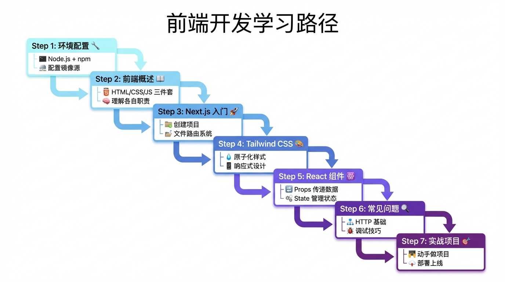

# 总结与实战

> **方法论**：学完就练，练完就用。做出来才是真的会。



---

## 📖 本节目标

学完本节，你将：
- ✅ 串联前端所有知识点
- ✅ 完成一个完整的实战项目
- ✅ 掌握 Vibe Coding 的核心工作流

**预计用时**：30 分钟

---

## 1. 知识回顾

### 1.1 学习路径总览

```
┌─────────────────────────────────────────────────────────┐
│                    前端开发基础                          │
├─────────────────────────────────────────────────────────┤
│                                                         │
│   01_环境配置        安装 Node.js、npm                   │
│        ↓            配置镜像源、理解 package.json        │
│                                                         │
│   02_前端概述        HTML = 骨架                         │
│        ↓            CSS = 皮肤                          │
│                     JavaScript = 肌肉                   │
│                                                         │
│   03_Next.js入门     创建项目、文件路由                   │
│        ↓            layout.tsx、page.tsx                │
│                                                         │
│   04_Tailwind入门    原子化 CSS、响应式                   │
│        ↓            hover:、md:、lg:                    │
│                                                         │
│   05_React组件       Props 传递数据                      │
│        ↓            State 管理状态                      │
│                     'use client'                        │
│                                                         │
│   06_常见问题        HTTP 基础、浏览器工具                │
│        ↓            报错排查、有效求助                   │
│                                                         │
│   07_总结与实战      知识串联、动手实践    ← 你在这里     │
│                                                         │
└─────────────────────────────────────────────────────────┘
```

### 1.2 核心概念速查表

| 概念 | 一句话解释 | 代码示例 |
|------|-----------|---------|
| HTML | 页面有什么内容 | `<div>`, `<button>` |
| CSS | 页面长什么样 | `color: red` |
| JavaScript | 页面能做什么 | `onClick={() => {}}` |
| Next.js | React 框架，文件即路由 | `src/app/about/page.tsx` → `/about` |
| Tailwind | CSS 写成类名 | `className="bg-blue-500"` |
| 组件 | 可复用的 UI 积木 | `<Button text="提交" />` |
| Props | 外部传入的数据 | `function Button({ text })` |
| State | 组件内部的记忆 | `const [count, setCount] = useState(0)` |

### 1.3 常用命令速查

```bash
# 创建项目
npx create-next-app@latest my-app

# 安装依赖
npm install

# 启动开发
npm run dev

# 构建生产
npm run build

# 配置镜像（下载慢时用）
npm config set registry https://registry.npmmirror.com
```

---

## 2. Vibe Coding 工作流

### 2.1 核心流程

```
需求描述 → AI 生成代码 → 运行查看 → 调整优化 → 完成
   │           │            │           │
   │           │            │           └── 复制错误问 AI
   │           │            └── npm run dev
   │           └── 把需求告诉 AI
   └── 想清楚要做什么
```

### 2.2 高效 Prompt 模板

**创建页面**：
```
帮我创建一个 Next.js 页面：
- 路径：/products
- 功能：显示产品列表
- 样式：使用 Tailwind CSS
- 布局：响应式，手机一列，电脑三列
```

**创建组件**：
```
帮我创建一个 React 组件：
- 名称：ProductCard
- Props：title, price, image, onBuy
- 样式：白色卡片，圆角阴影
- 交互：点击按钮调用 onBuy
```

**修复问题**：
```
我遇到了这个错误：
[粘贴完整错误信息]

我的代码是：
[粘贴相关代码]

请帮我分析原因并给出解决方案
```

---

## 3. 实战项目：个人简历页

### 3.1 项目目标

创建一个包含以下内容的个人简历网站：
- 首页：个人介绍
- 技能页：技能列表
- 项目页：项目展示
- 联系页：联系方式

### 3.2 步骤 1：创建项目

```bash
# 创建项目
npx create-next-app@latest my-resume

# 选择选项
✔ TypeScript? › Yes
✔ ESLint? › Yes
✔ Tailwind CSS? › Yes
✔ src/ directory? › Yes
✔ App Router? › Yes

# 进入项目并启动
cd my-resume
npm run dev
```

### 3.3 步骤 2：创建布局

修改 `src/app/layout.tsx`：

```tsx
import Link from 'next/link'
import './globals.css'

export default function RootLayout({
  children,
}: {
  children: React.ReactNode
}) {
  return (
    <html lang="zh-CN">
      <body>
        {/* 导航栏 */}
        <nav className="bg-gray-800 text-white">
          <div className="max-w-4xl mx-auto px-4">
            <div className="flex justify-between items-center h-16">
              <span className="text-xl font-bold">我的简历</span>
              <div className="flex gap-6">
                <Link href="/" className="hover:text-blue-400">首页</Link>
                <Link href="/skills" className="hover:text-blue-400">技能</Link>
                <Link href="/projects" className="hover:text-blue-400">项目</Link>
                <Link href="/contact" className="hover:text-blue-400">联系</Link>
              </div>
            </div>
          </div>
        </nav>

        {/* 页面内容 */}
        <main className="max-w-4xl mx-auto px-4 py-8">
          {children}
        </main>

        {/* 页脚 */}
        <footer className="bg-gray-100 text-center py-4 text-gray-600">
          © 2024 我的简历 | 用 Next.js + Tailwind 构建
        </footer>
      </body>
    </html>
  )
}
```

### 3.4 步骤 3：创建首页

修改 `src/app/page.tsx`：

```tsx
export default function HomePage() {
  return (
    <div className="text-center">
      {/* 头像和名字 */}
      <div className="mb-8">
        <div className="w-32 h-32 bg-gray-300 rounded-full mx-auto mb-4 flex items-center justify-center text-4xl">
          👤
        </div>
        <h1 className="text-3xl font-bold">你的名字</h1>
        <p className="text-gray-600 mt-2">前端开发者 | Vibe Coder</p>
      </div>

      {/* 简介 */}
      <div className="bg-white rounded-lg shadow p-6 text-left">
        <h2 className="text-xl font-bold mb-4">关于我</h2>
        <p className="text-gray-600 leading-relaxed">
          我是一名热爱技术的开发者，正在学习 Vibe Coding。
          我相信用 AI 可以加速开发，把想法快速变成现实。
          目前正在学习 Next.js、Tailwind CSS 和 React。
        </p>
      </div>
    </div>
  )
}
```

### 3.5 步骤 4：创建技能页

创建 `src/app/skills/page.tsx`：

```tsx
const skills = [
  { name: 'HTML/CSS', level: 80 },
  { name: 'JavaScript', level: 70 },
  { name: 'React', level: 60 },
  { name: 'Next.js', level: 50 },
  { name: 'Tailwind CSS', level: 70 },
]

export default function SkillsPage() {
  return (
    <div>
      <h1 className="text-3xl font-bold mb-8">我的技能</h1>

      <div className="space-y-4">
        {skills.map((skill) => (
          <div key={skill.name} className="bg-white rounded-lg shadow p-4">
            <div className="flex justify-between mb-2">
              <span className="font-medium">{skill.name}</span>
              <span className="text-gray-500">{skill.level}%</span>
            </div>
            <div className="w-full bg-gray-200 rounded-full h-3">
              <div
                className="bg-blue-500 h-3 rounded-full"
                style={{ width: `${skill.level}%` }}
              />
            </div>
          </div>
        ))}
      </div>
    </div>
  )
}
```

### 3.6 步骤 5：创建项目页

创建 `src/app/projects/page.tsx`：

```tsx
const projects = [
  {
    title: '个人简历网站',
    description: '使用 Next.js + Tailwind CSS 构建的个人简历',
    tags: ['Next.js', 'Tailwind'],
  },
  {
    title: '待办事项 App',
    description: '一个简单的待办事项管理应用',
    tags: ['React', 'useState'],
  },
]

export default function ProjectsPage() {
  return (
    <div>
      <h1 className="text-3xl font-bold mb-8">我的项目</h1>

      <div className="grid md:grid-cols-2 gap-6">
        {projects.map((project) => (
          <div key={project.title} className="bg-white rounded-lg shadow p-6">
            <h3 className="text-xl font-bold mb-2">{project.title}</h3>
            <p className="text-gray-600 mb-4">{project.description}</p>
            <div className="flex gap-2">
              {project.tags.map((tag) => (
                <span
                  key={tag}
                  className="bg-blue-100 text-blue-600 px-2 py-1 rounded text-sm"
                >
                  {tag}
                </span>
              ))}
            </div>
          </div>
        ))}
      </div>
    </div>
  )
}
```

### 3.7 步骤 6：创建联系页

创建 `src/app/contact/page.tsx`：

```tsx
'use client'
import { useState } from 'react'

export default function ContactPage() {
  const [submitted, setSubmitted] = useState(false)

  const handleSubmit = (e: React.FormEvent) => {
    e.preventDefault()
    setSubmitted(true)
  }

  if (submitted) {
    return (
      <div className="text-center py-12">
        <div className="text-6xl mb-4">✅</div>
        <h2 className="text-2xl font-bold">感谢你的留言！</h2>
        <p className="text-gray-600 mt-2">我会尽快回复你</p>
      </div>
    )
  }

  return (
    <div>
      <h1 className="text-3xl font-bold mb-8">联系我</h1>

      <form onSubmit={handleSubmit} className="bg-white rounded-lg shadow p-6">
        <div className="mb-4">
          <label className="block text-sm font-medium mb-1">你的名字</label>
          <input
            type="text"
            required
            className="w-full border rounded-lg px-3 py-2 focus:border-blue-500 focus:ring-1"
            placeholder="请输入名字"
          />
        </div>

        <div className="mb-4">
          <label className="block text-sm font-medium mb-1">邮箱地址</label>
          <input
            type="email"
            required
            className="w-full border rounded-lg px-3 py-2 focus:border-blue-500 focus:ring-1"
            placeholder="请输入邮箱"
          />
        </div>

        <div className="mb-4">
          <label className="block text-sm font-medium mb-1">留言内容</label>
          <textarea
            required
            rows={4}
            className="w-full border rounded-lg px-3 py-2 focus:border-blue-500 focus:ring-1"
            placeholder="请输入留言"
          />
        </div>

        <button
          type="submit"
          className="w-full bg-blue-500 hover:bg-blue-600 text-white py-2 rounded-lg"
        >
          发送留言
        </button>
      </form>
    </div>
  )
}
```

---

## 4. 自我检测清单

完成学习后，用这个清单检测自己：

### 环境配置
- [ ] 能运行 `node -v` 和 `npm -v` 看到版本号
- [ ] 知道 `npm install` 是干什么的
- [ ] 知道 package.json 记录了什么

### 前端基础
- [ ] 能说出 HTML、CSS、JS 各自的作用
- [ ] 知道前端和后端的区别

### Next.js
- [ ] 能用 `npx create-next-app` 创建项目
- [ ] 知道 `src/app/about/page.tsx` 对应什么网址
- [ ] 会用 `Link` 组件跳转页面

### Tailwind CSS
- [ ] 知道 `p-4` 是什么意思
- [ ] 会用 `flex justify-center items-center` 居中
- [ ] 知道 `md:` 前缀是干什么的

### React 组件
- [ ] 能创建一个简单的组件
- [ ] 知道 Props 和 State 的区别
- [ ] 知道什么时候要加 `'use client'`

### 问题排查
- [ ] 知道按 F12 打开开发者工具
- [ ] 会在 Console 看错误信息
- [ ] 会在 Network 看接口请求

---

## 5. 下一步建议

### 短期目标（1-2 周）
1. 完成个人简历项目
2. 尝试修改样式和内容
3. 部署到 Vercel（免费）

### 中期目标（1 个月）
1. 学习后端基础
2. 尝试做一个带数据库的项目
3. 实现用户登录功能

### 长期目标（3 个月）
1. 完成一个完整的产品（如知识付费平台）
2. 实现支付功能
3. 正式上线运营

---

## 📝 小结

**前端开发的核心**：
1. **工具**：Node.js + npm + Next.js
2. **结构**：HTML（骨架）+ CSS（皮肤）+ JS（肌肉）
3. **框架**：React 组件化 + Tailwind 原子化
4. **方法**：Vibe Coding = 描述需求 + AI 生成 + 调试优化

**记住**：
- 不用背代码，用到就问 AI
- 不用求完美，能跑就是成功
- 多做项目，做中学最快

---

## 📚 完成！

恭喜你完成了前端开发基础的学习！

👉 [后端开发基础](../后端.md)

学习如何用 FastAPI 创建后端 API，让你的网站能存储和读取数据。

返回 [前端开发基础](./README.md) 查看完整目录。
